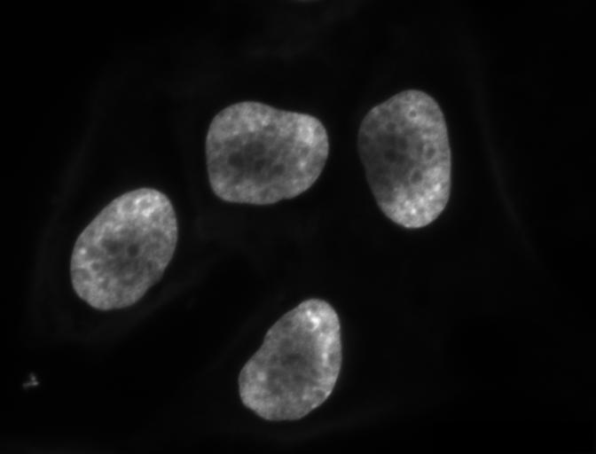
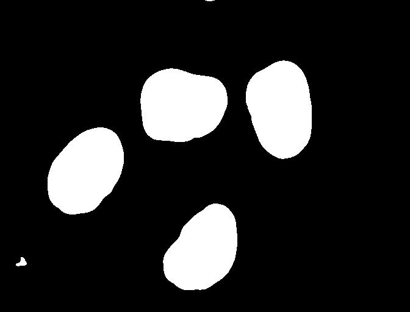
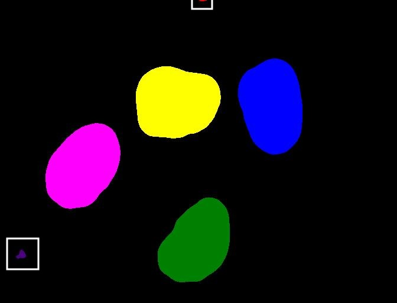
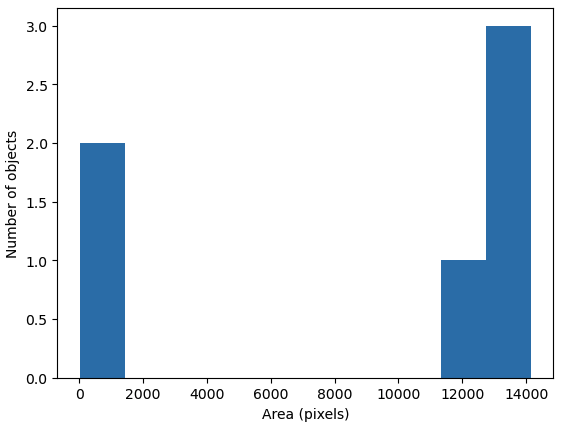
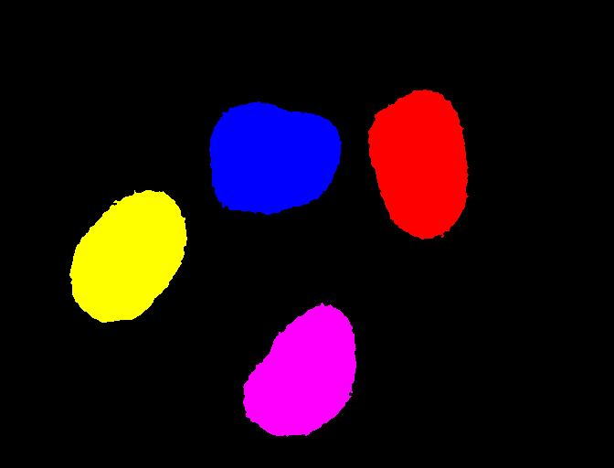
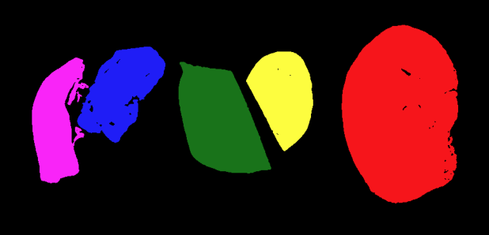

::::::::::::::::::::::::::::::::::::::: objectives

- Understand the term object in the context of images.
- Learn about pixel connectivity.
- Learn how Connected Component Analysis (CCA) works.
- Use CCA to produce an image that highlights every object in a different colour.
- Characterise each object with numbers that describe its appearance.

::::::::::::::::::::::::::::::::::::::::::::::::::

:::::::::::::::::::::::::::::::::::::::: questions

- How to extract separate objects from an image and describe these objects quantitatively.

::::::::::::::::::::::::::::::::::::::::::::::::::

## Objects

In [the *Thresholding* episode](07-thresholding.md)
we have covered dividing an image into foreground and background pixels.
In the HeLa cells example image blue channel,
we considered the coloured nuclei as foreground *objects* on a black background.

{alt='Nuclei channel of HeLa cells'}

In thresholding we went from the original image to this version:

{alt='Mask created by thresholding'}

Here, we created a mask that only highlights the parts of the image
that we find interesting, the *objects*.
All objects have pixel value of `True` while the background pixels are `False`.

By looking at the mask image,
one can count the objects that are present in the image.
But how did we actually do that,
how did we decide which lump of pixels constitutes a single object?

## Pixel Neighborhoods

In order to decide which pixels belong to the same object,
one can exploit their neighborhood:
pixels that are directly next to each other
and belong to the foreground class can be considered to belong to the same object.

Let's discuss the concept of pixel neighborhoods in more detail.
Consider the following mask "image" with 8 rows, and 8 columns.
For the purpose of illustration, the digit `0` is used to represent
background pixels, and the letter `X` is used to represent
object pixels foreground).

```output
0 0 0 0 0 0 0 0
0 X X 0 0 0 0 0
0 X X 0 0 0 0 0
0 0 0 X X X 0 0
0 0 0 X X X X 0
0 0 0 0 0 0 0 0
```

The pixels are organised in a rectangular grid.
In order to understand pixel neighborhoods
we will introduce the concept of "jumps" between pixels.
The jumps follow two rules:
First rule is that one jump is only allowed along the column, or the row.
Diagonal jumps are not allowed.
So, from a centre pixel, denoted with `o`,
only the pixels indicated with a `1` are reachable:

```output
- 1 -
1 o 1
- 1 -
```

The pixels on the diagonal (from `o`) are not reachable with a single jump,
which is denoted by the `-`.
The pixels reachable with a single jump form the **1-jump** neighborhood.

The second rule states that in a sequence of jumps,
one may only jump in row and column direction once -> they have to be *orthogonal*.
An example of a sequence of orthogonal jumps is shown below.
Starting from `o` the first jump goes along the row to the right.
The second jump then goes along the column direction up.
After this,
the sequence cannot be continued as a jump has already been made
in both row and column direction.

```output
- - 2
- o 1
- - -
```

All pixels reachable with one, or two jumps form the **2-jump** neighborhood.
The grid below illustrates the pixels reachable from
the centre pixel `o` with a single jump, highlighted with a `1`,
and the pixels reachable with 2 jumps with a `2`.

```output
2 1 2
1 o 1
2 1 2
```

We want to revisit our example image mask from above and apply
the two different neighborhood rules.
With a single jump connectivity for each pixel, we get two resulting objects,
highlighted in the image with `A`'s and `B`'s.

```output
0 0 0 0 0 0 0 0
0 A A 0 0 0 0 0
0 A A 0 0 0 0 0
0 0 0 B B B 0 0
0 0 0 B B B B 0
0 0 0 0 0 0 0 0
```

In the 1-jump version,
only pixels that have direct neighbors along rows or columns are considered connected.
Diagonal connections are not included in the 1-jump neighborhood.
With two jumps, however, we only get a single object `A` because pixels are also
considered connected along the diagonals.

```output
0 0 0 0 0 0 0 0
0 A A 0 0 0 0 0
0 A A 0 0 0 0 0
0 0 0 A A A 0 0
0 0 0 A A A A 0
0 0 0 0 0 0 0 0
```

:::::::::::::::::::::::::::::::::::::::  challenge

## Object counting (optional, not included in timing)

How many objects with 1 orthogonal jump, how many with 2 orthogonal jumps?

```output
0 0 0 0 0 0 0 0
0 X 0 0 0 X X 0
0 0 X 0 0 0 0 0
0 X 0 X X X 0 0
0 X 0 X X 0 0 0
0 0 0 0 0 0 0 0
```

1 jump

a) 1
b) 5
c) 2

:::::::::::::::  solution

## Solution

b) 5


:::::::::::::::::::::::::

2 jumps

a) 2
b) 3
c) 5

:::::::::::::::  solution

## Solution

a) 2


:::::::::::::::::::::::::

::::::::::::::::::::::::::::::::::::::::::::::::::

:::::::::::::::::::::::::::::::::::::::::  callout

## Jumps and neighborhoods

We have just introduced how you can reach different neighboring
pixels by performing one or more orthogonal jumps. We have used the
terms 1-jump and 2-jump neighborhood. There is also a different way
of referring to these neighborhoods: the 4- and 8-neighborhood.
With a single jump you can reach four pixels from a given starting
pixel. Hence, the 1-jump neighborhood corresponds to the
4-neighborhood. When two orthogonal jumps are allowed, eight pixels
can be reached, so the 2-jump neighborhood corresponds to the
8-neighborhood.


::::::::::::::::::::::::::::::::::::::::::::::::::

## Connected Component Analysis

In order to find the objects in an image (also known as segmentation), we want to employ an
operation that is called Connected Component Analysis (CCA).
This operation takes a binary image as an input.
Usually, the `False` value in this image is associated with background pixels,
and the `True` value indicates foreground, or object pixels.
Such an image can be produced, e.g., with thresholding.
Given a thresholded image,
the connected component analysis produces a new *labeled* image with integer pixel values.
Pixels with the same value, belong to the same object.
scikit-image provides connected component analysis in the function `ski.measure.label()`.
Let us add this function to the already familiar steps of thresholding an image.

First, import the packages needed for this episode:

```python
import imageio.v3 as iio
import ipympl
import matplotlib.pyplot as plt
import numpy as np
import skimage as ski

%matplotlib widget
```

In this episode, we will use the `ski.measure.label` function to perform the CCA. For example, we want to label individual
nuclei from the HeLa cells image.

We start by generating the binary mask of the foreground of the blue (nuclei) channel of the image, as in [the *Thresholding* episode](07-thresholding.md).

```python
# load the image
cells = iio.imread(uri="data/hela-cells-8bit.tif")
blue_channel = cells[:,:,2]

sigma=2.0
t=0.1
# denoise the image with a Gaussian filter
blurred_image = ski.filters.gaussian(blue_channel, sigma=sigma)
# black background so select values greater than threshod
binary_mask = blurred_image > t
```
We are purposefully separating out the parameters as variables for ease of editing later.

Then we call the `ski.measure.label` function.

```python
connectivity=2
# perform connected component analysis
labeled_image, count = ski.measure.label(binary_mask,
                                        connectivity=connectivity, return_num=True)
```

This function has one positional argument where we pass the `binary_mask`,
i.e., the binary image to work on.
With the optional argument `connectivity`,
we specify the neighborhood in units of orthogonal jumps.
For example,
by setting `connectivity=2` we will consider the 2-jump neighborhood introduced above.
The function returns a `labeled_image` where each pixel has
a unique value corresponding to the object it belongs to.
In addition, we pass the optional parameter `return_num=True` to return
the maximum label index as `count`.

:::::::::::::::::::::::::::::::::::::::::  callout

## Optional parameters and return values

The optional parameter `return_num` changes the data type that is
returned by the function `ski.measure.label`.
The number of labels is only returned if `return_num` is *True*.
Otherwise, the function only returns the labeled image.
This means that we have to pay attention when assigning
the return value to a variable.
If we omit the optional parameter `return_num` or pass `return_num=False`,
we can call the function as

```python
labeled_image = ski.measure.label(binary_mask)
```

If we pass `return_num=True`, the function returns a tuple and we
can assign it as

```python
labeled_image, count = ski.measure.label(binary_mask, return_num=True)
```

If we used the same assignment as in the first case,
the variable `labeled_image` would become a tuple,
in which `labeled_image[0]` is the image
and `labeled_image[1]` is the number of labels.
This could cause confusion if we assume that `labeled_image`
only contains the image and pass it to other functions.
If you get an
`AttributeError: 'tuple' object has no attribute 'shape'`
or similar,  check if you have assigned the return values consistently
with the optional parameters.


::::::::::::::::::::::::::::::::::::::::::::::::::

We display the labeled image like so:

```python
fig, ax = plt.subplots()
ax.imshow(labeled_image)
```

We can use the function `ski.color.label2rgb()`
to convert the 32-bit grayscale labeled image to standard RGB colour
(recall that we already used the `ski.color.rgb2gray()` function
to convert to grayscale).
With `ski.color.label2rgb()`,
all objects are coloured according to a list of colours that can be customised.
We can use the following commands to convert and show the image:

```python
# convert the label image to color image
colored_label_image = ski.color.label2rgb(labeled_image, bg_label=0)

fig, ax = plt.subplots()
ax.imshow(colored_label_image)
```

{alt='Labeled objects'}


:::::::::::::::::::::::::::::::::::::::  challenge

## How does parameter choice change how many objects are in the image? (15 min)

Now, it is your turn to practice.
Using the function `segment_multichannel`, print out the value `count` to
see how many objects were found in the image.

What number of objects would you expect to get?

How does changing the `sigma` and `threshold` values influence the result?

:::::::::::::::  solution

## Solution

As you might have guessed, the return value `count` already
contains the number of objects found in the image. So it can simply be printed
with

```python
print("Found", count, "objects in the image.")
```

But there is also a way to obtain the number of found objects from
the labeled image itself.
Recall that all pixels that belong to a single object
are assigned the same integer value.
The connected component algorithm produces consecutive numbers.
The background gets the value `0`,
the first object gets the value `1`,
the second object the value `2`, and so on.
This means that by finding the object with the maximum value,
we also know how many objects there are in the image.
We can thus use the `np.max` function from NumPy to
find the maximum value that equals the number of found objects:

```python
num_objects = np.max(labeled_image)
print("Found", num_objects, "objects in the image.")
```

Invoking the function with `sigma=1.0`, and `threshold=0.1`,
both methods will print

```output
Found 6 objects in the image.
```

##  How do parameters affect output?
Raising the threshold will result in fewer objects.
The lower the threshold is set, the more objects are found.
More and more background noise gets picked up as objects.
Larger sigmas produce binary masks with less noise and hence
a smaller number of objects.
Setting sigma too high bears the danger of merging objects.


:::::::::::::::::::::::::

::::::::::::::::::::::::::::::::::::::::::::::::::

You might wonder why the connected component analysis with `sigma=1.0`,
and `threshold=0.1` finds 6 objects, whereas we would expect only 4 objects.
Where are the two additional objects?
With a bit of detective work, we can spot some small objects in the image,
for example, near the bottom left corner and top border.

{alt='Highlighting small labeled objects in cell image'}

For us it is clear that these small spots are artifacts and
not objects we are interested in.
But how can we tell the computer?
One way to calibrate the algorithm is to adjust the parameters for
blurring (`sigma`) and thresholding (`t`),
but you may have noticed during the above exercise that
it is quite hard to find a combination that produces the right output number.
In some cases, background noise gets picked up as an object.
And with other parameters,
some of the foreground objects get broken up or disappear completely.
Therefore, we need other criteria to describe desired properties of the objects
that are found.

## Morphometrics - Describe object features with numbers

Morphometrics is concerned with the quantitative analysis of objects and
considers properties such as size and shape.
For the example of the images with the cells,
our intuition tells us that the objects should be of a certain size or area.
So we could use a minimum area as a criterion for when an object should be detected.
To apply such a criterion,
we need a way to calculate the area of objects found by connected components.
The scikit-image library provides the function `ski.measure.regionprops`
to measure the properties of labeled regions.
It returns a list of `RegionProperties` that describe each connected region in the images.
The properties can be accessed using the attributes of the `RegionProperties` data type.
Here we will use the properties `"area"` and `"label"`.
You can explore [the scikit-image documentation on regionprops](https://scikit-image.org/docs/stable/api/skimage.measure.html#skimage.measure.regionprops) to learn about other properties available.

We can get a list of areas of the labeled objects as follows:

```python
# compute object features and extract object areas
np.set_printoptions(legacy='1.25')
object_features = ski.measure.regionprops(labeled_image)
object_areas = [objf["area"] for objf in object_features]
object_areas
```

This will produce the output

```output
[20.0, 13722.0, 14147.0, 13308.0, 12629.0, 156.0]
```

:::::::::::::::::::::::::::::::::::::::::  callout

## Numpy print options

For our purposes, it's nicer to only print the numbers from the object features
rather than including the datatypes, as newer Numpy versions print. We can do this
by setting the Numpy print options to a legacy version:

```python
np.set_printoptions(legacy='1.25')
```
::::::::::::::::::::::::::::::::::::::::::::::::::

:::::::::::::::::::::::::::::::::::::::  challenge

## Investigate other regionprops

Use the [skimage.measure.regionprops documentation](https://scikit-image.org/docs/stable/api/skimage.measure.html#skimage.measure.regionprops)
for to identify other object features. Print out some of those features.

:::::::::::::::  solution

## Solution

For example, to print centroids:
```python
object_features = ski.measure.regionprops(labeled_image)
object_centroids = [objf["centroid"] for objf in object_features]
print(object_centroids)
```
It may be necessary to convert the feature values to a different data type (e.g. `int`, as for the areas).

:::::::::::::::::::::::::

::::::::::::::::::::::::::::::::::::::::::::::::::

:::::::::::::::::::::::::::::::::::::::  challenge

## Plot a histogram of the object area distribution (10 min)

Similar to how we determined a "good" threshold in
[the *Thresholding* episode](07-thresholding.md),
it is often helpful to inspect the histogram of an object property.
For example, we want to look at the distribution of the object areas.

1. Create and examine a [histogram](05-creating-histograms.md)
  of the object areas obtained with `ski.measure.regionprops`.
2. What does the histogram tell you about the objects?

:::::::::::::::  solution

## Solution

The histogram can be plotted with

```python
fig, ax = plt.subplots()
ax.hist(object_areas)
ax.set_xlabel("Area (pixels)")
ax.set_ylabel("Number of objects");
```

{alt='Histogram of object areas'}

The histogram shows the number of objects (vertical axis)
whose area is within a certain range (horizontal axis).
The height of the bars in the histogram indicates
the prevalence of objects with a certain area.
The whole histogram tells us about the distribution of object sizes in the image.
It is often possible to identify gaps between groups of bars
(or peaks if we draw the histogram as a continuous curve)
that tell us about certain groups in the image.

In this example, we can see that there are two small objects that
contain less than 2000 pixels.
Then there is a group of four (1+3) objects in
the range between 10000 and 15000.
For our object count, we might want to disregard the small objects as artifacts,
i.e, we want to ignore the leftmost bar of the histogram.
We could use a threshold of 8000 as the minimum area to count.
In fact, the `object_areas` list already tells us that
there are fewer than 200 pixels in these objects.
Therefore, it is reasonable to require a minimum area of at least 200 pixels
for a detected object.
In practice, finding the "right" threshold can be tricky and
usually involves an educated guess based on domain knowledge.
For example, if you know the micrometer size of your pixel resolution and expected size
of the cells you are imaging, you could compute the expected number of pixels per cell
area and keep objects of that size.


:::::::::::::::::::::::::

::::::::::::::::::::::::::::::::::::::::::::::::::


:::::::::::::::::::::::::::::::::::::::::  callout

## Using functions from NumPy and other Python packages

Functions from Python packages such as NumPy are often more efficient and
require less code to write.
It is a good idea to browse the reference pages of `numpy` and `skimage` to
look for an availabe function that can solve a given task.

::::::::::::::::::::::::::::::::::::::::::::::::::


An elegant way to remove small objects from the image is
to leverage the `ski.morphology` module.
It provides a function `ski.morphology.remove_small_objects` that
does exactly what we are looking for.
It can be applied to either a binary or a label image and
returns a mask in which all objects smaller than `min_area` are excluded,
i.e, their pixel values are set to `False` or the background label value.

```python
filtered_labels = ski.morphology.remove_small_objects(labeled_image, min_size=1000)
```

We display the resulting label image and print the number of objects:

```python
color_filtered_labels = ski.color.label2rgb(filtered_labels, bg_label=0)
fig, ax = plt.subplots()
ax.imshow(color_filtered_labels)

print("Found", count, "objects in the image.")
```

{alt='Objects filtered by area'}

```output
Found 4 objects in the image.
```

Note that the small objects are "gone" and we obtain the correct
number of 4 objects in the image.

:::::::::::::::::::::::::::::::::::::::  challenge

## Segment tissue sections from an H&E image

Repeat the same steps as above for the H&E image to segment the different tissue sections. Identify the best parameter choices for 
`sigma`, `t`, `connectivity`, and `min_size`. 

Two things to remember:

- The H&E image has RGB color channels that don't mean anything on their own, so it is best to convert it to
grayscale before blurring and thresholding

- The H&E image has a light background, so the pixel values to turn "on" with a threshold will be *less than* (`<`)
the threshold value `t`.

:::::::::::::::  solution

## Solution


```python
# load the image
he_image = iio.imread(uri="data/he_scale3.tif")
# convert the image to grayscale
he_gray = ski.color.rgb2gray(he_image)

sigma=1.0 # spleen sections are merged at sigma > 1
t=0.8
connectivity=2
# denoise the image with a Gaussian filter
blurred_image = ski.filters.gaussian(he_gray, sigma=sigma)
# white background so select values greater than threshod
binary_mask = blurred_image < t
# perform connected component analysis
labeled_image, count = ski.measure.label(binary_mask,
                                        connectivity=connectivity, return_num=True)

print("Found", count, "objects in the image.")                  
```

```output
Found 12 objects in the image.
```

```python
object_features = ski.measure.regionprops(labeled_image)
object_areas = [int(objf["area"]) for objf in object_features]
print(object_areas)
```

```output
[7, 55189, 16201, 14900, 14929, 23419, 4, 24, 2, 27, 2, 2]
```

```python
filtered_labels = ski.morphology.remove_small_objects(labeled_image, min_size=1000)
color_filtered_labels = ski.color.label2rgb(filtered_labels, bg_label=0)
fig, ax = plt.subplots()
ax.imshow(color_filtered_labels)
```

{alt='H&E tissue sections segmented'}


:::::::::::::::::::::::::

::::::::::::::::::::::::::::::::::::::::::::::::::

:::::::::::::::::::::::::::::::::::::::: keypoints

- We can use `ski.measure.label` to find and label connected objects in an image.
- We can use `ski.measure.regionprops` to measure properties of labeled objects.
- We can use `ski.morphology.remove_small_objects` to mask small objects and remove artifacts from an image.
- We can display the labeled image to view the objects coloured by label.

::::::::::::::::::::::::::::::::::::::::::::::::::
